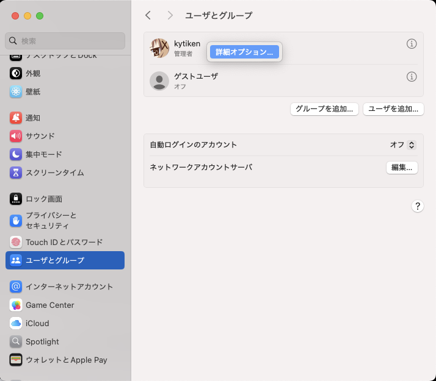
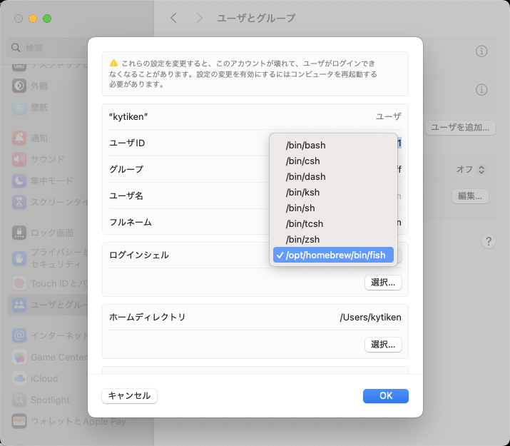

# Change default shell to fish

1. memo fish path

   ```shell
   which fish
   ```

1. add fish to shells

   ```shell
   sudo -e /etc/shells
   ```

1. open PreferencePanes > Users & Groups Pane

   ```
   open -b com.apple.systempreferences /System/Library/PreferencePanes/Accounts.prefPane
   ```

1. Ctrl+click user

   

1. choose shell

   
